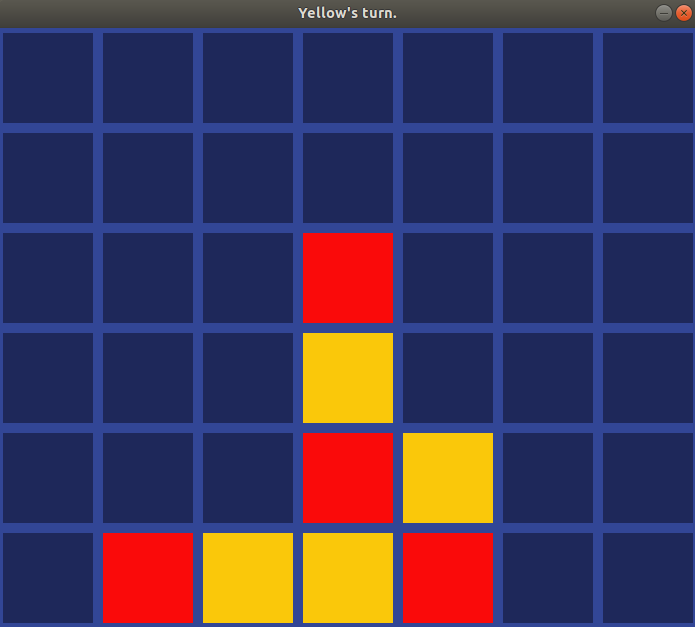

# connect-four

An implementation of (an AI for) the classic board game [Connect Four](https://en.wikipedia.org/wiki/Connect_Four).
The AI uses [Monte Carlo Tree Search](https://en.wikipedia.org/wiki/Monte_Carlo_tree_search) to choose its actions. In particular, it uses *Upper Confidence Bound 1 applied to trees* (UCT) as the tree policy.
Try and see if you can beat it!



## Dependencies
The main dependency is the [SDL2](https://www.libsdl.org/) library used for the GUI.
To run the project, you'll need the following:
* cmake >= 3.7
* make >= 4.1 for Linux and Mac, 3.81 for Windows
* gcc/g++ >= 7.0
* SDL2 >= 2.0 (https://wiki.libsdl.org/Installation)

## Usage
Make sure all of the dependencies mentioned above are installed. Then, clone and enter the repo:
```
git clone https://github.com/leotappe/connect-four.git
cd connect-four
```
Create and enter a build directory:
```
mkdir build
cd build
```
Compile using cmake and make:
```
cmake ..
make
```
There should now be an executable in your build directory named `connect4`. You can run it using
```
./connect4
```
Have fun!

## Resources
I used the following material to learn about Monte Carlo Tree Search:
* [Wikipedia](https://en.wikipedia.org/wiki/Monte_Carlo_tree_search)
* [Reinforcement Learning: An Introduction](http://incompleteideas.net/book/the-book.html)
* [Efficient Selectivity and Backup Operators in Monte-Carlo Tree Search](https://hal.inria.fr/inria-00116992/document)
* [Bandit based Monte-Carlo Planning](http://ggp.stanford.edu/readings/uct.pdf)
